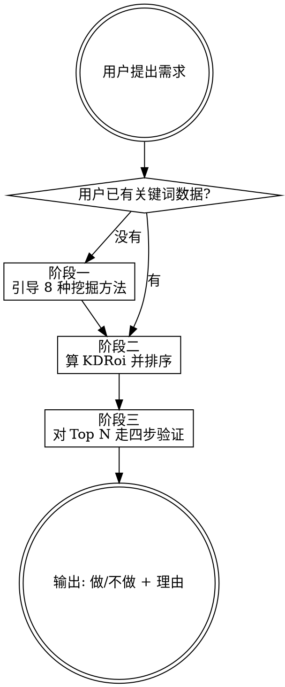

# niche-finder

## Overview

这个 skill 引导用户从海量关键词里挑出**值得做**的那一个——不是搜索量最大的，而是综合搜索量、变现空间、竞争难度后**性价比最高**的。

**核心公式**：

```
KDRoi = Volume × CPC / KD
```

**核心信念**：
- 离钱越近的关键词越值钱
- 搜索量大 ≠ 值得做
- 数据决策 > 直觉决策

## When to Use

应触发：
- 用户问"做什么站 / 做什么方向 / 选什么 niche"
- 用户贴了一个关键词问"这个能做吗 / 值不值得做"
- 用户贴了一批关键词或 CSV（Semrush/Ahrefs 导出）让筛选排序
- 用户提到"出海"、"独立开发者 SaaS"、"AI 工具站" 并要求选方向
- 用户要求用 KDRoi 公式打分

不应触发：
- 已选好方向要写 SEO 内容 / 落地页文案 → SEO content skill
- 规模化程序化 SEO (pSEO) → pSEO skill
- 写 PRD / 规划 MVP → `orchestrating-project-bootstrap`
- 纯产品点子脑暴 → `superpowers:brainstorming`
- 评估已有产品 PMF / 做用户访谈 → `value-realization`

## Core Workflow

三阶段：**挖掘候选 → 打分排序 → 验证决策**。



### 阶段一：挖掘候选（用户还没有关键词时）

1. 先问清两件事：**方向偏好**（工具类 / 内容类 / 特定行业？）和**语言/地区**（英文出海 / 中文国内？）
2. 给新手推荐起点：**51 词根清单**（见 `references/word-roots.md`），让用户挑 1-2 个感兴趣的词根
3. 介绍可选的 8 种挖掘方法（见 `references/methods.md`），并按用户情况推荐合适的 1-2 种
4. 给出每种方法的**具体操作路径**（工具 + 步骤 + 筛选条件），不要只说"用 Semrush 查"就完事

### 阶段二：打分排序（拿到关键词或 CSV 后）

1. 确认数据齐全：**Keyword / Volume / CPC / KD** 四列（通常 Semrush 导出直接有）
2. 有 CSV 文件时，**必须调用脚本**：
   ```bash
   python3 ~/.claude/skills/niche-finder/scripts/kdroi.py <csv_path>
   ```
   脚本默认筛选：`KD ≤ 30 且 200 ≤ Volume ≤ 10000 且 CPC ≥ 0.1`，排除 "near me"，按 KDRoi 降序输出 Top 20 的 Markdown 表格。可选参数 `--kd-max / --vol-min / --vol-max / --cpc-min / --top / --no-filter`，详见 `--help`。
3. 少量关键词（手动列的几个）也可以直接逐个算 `Volume × CPC / KD`，但必须让用户看到分数，不凭感觉排序
4. 输出 Top 候选清单（Markdown 表格，见下方 Output Contract）

### 阶段三：验证决策（对 Top N 候选）

对排名靠前的候选**逐个走四步验证**（完整判定见 `references/validation.md`）：

| 步 | 工具 | 通过条件（新手档） | 硬否决 |
|---|---|---|---|
| 1. 数据 | Semrush / Ahrefs | KD ≤ 30，Volume ≥ 200，意图明确 | KD > 50 |
| 2. 趋势 | Google Trends | 全年稳定或上升 | 12 月里 < 3 月有量的季节词 |
| 3. 竞争 | Google SERP 首页 | 至少 3 条小站/博客 | 首页全是 Wikipedia / Amazon / 官方 |
| 4. 变现 | CPC | CPC ≥ $0.5 最佳；≥ $0.1 可接受 | CPC < $0.05 |

**四步全过 → 做；任一"硬否决"命中 → 不做**。部分通过时，给出风险点让用户权衡。

验证期间主动对照**四大坑**（见 `references/pitfalls.md`），发现苗头要提醒：
- 凭直觉（没有 Semrush 数据支撑）
- 追大词（KD>50 硬冲）
- 忽略 CPC（只看 Volume）
- 不验证就动手（四步没走就说"做吧"）

## Output Contract

最终交付必须包含三块（缺一不可）：

### 1. 候选清单表

```markdown
| 排名 | 关键词 | Volume | CPC | KD | KDRoi | 决策 | 主要理由 |
|---|---|---|---|---|---|---|---|
| 1 | AI Headshot Generator | 8100 | $3.5 | 18 | 1575 | ✅ 做 | 四步全过 |
| 2 | Invoice Generator | 22000 | $4.2 | 45 | 2053 | ⚠️ 观望 | KDRoi 高但 KD>30 |
| 3 | QR Code Generator | 45000 | $0.8 | 72 | 500 | ❌ 不做 | KD 过高，SERP 全巨头 |
```

### 2. 推荐优先做（详述一个最佳候选）

```markdown
**[关键词]** — KDRoi [分数]

- **数据**：Volume [x] / CPC $[x] / KD [x]
- **趋势**：[Google Trends 12 月曲线描述]
- **竞争**：[SERP 首页前 3-5 个站的性质]
- **变现**：[CPC 档位 + 潜在变现方式: 广告/会员/一次性付费]
```

### 3. 下一步动作清单

```markdown
1. [具体动作，例如"用 Semrush 导出 AI Headshot 相关的长尾词清单"]
2. [例如"做 3 个同类站的 SERP 截图对比"]
3. [例如"确认 12 月趋势是上升还是下降"]
```

## Quick Reference

### KDRoi 分数解读

| KDRoi | 含义 |
|---|---|
| > 1500 | 极优，优先做 |
| 500-1500 | 优，值得做 |
| 100-500 | 可做，关注 KD 是否 ≤30 |
| < 100 | 避开或继续挖 |

**注意**：KDRoi 再高，若 KD > 50，新手一律避开——分数高往往来自搜索量，但新站打不上去。

### 新手默认阈值（CSV 筛选）

| 字段 | 条件 |
|---|---|
| KD | 0 – 29 |
| Volume | 200 – 10,000 |
| CPC | ≥ $0.1 |
| 关键词 | 排除 "near me" |

### 决策速查

```
✅ 做：KD≤30 + Volume≥200 + CPC≥$0.5 + SERP 首页无巨头垄断 + 全年稳定/上升
⚠️ 观望：仅 1 条硬否决外的指标未达标
❌ 不做：命中任一硬否决（KD>50 / 全巨头 / CPC<$0.05 / 强季节性）
```

## Common Mistakes

- **拿到词根就建站，不筛选** → 必须先过 `kdroi.py` 或手算 KDRoi
- **只看 Volume 大就冲** → 忽略 CPC 和 KD 的决策没有意义
- **没给分数就说"值得做"** → 决策必须附带 KDRoi 数值
- **SERP 第一条是大站就全盘放弃** → 要看整个第一页 10 条，有 3-5 条不知名小站就是机会
- **忽略季节性** → 必须把 Google Trends 12 个月曲线截图/描述附上
- **CPC<$0.05 还硬上** → 流量无法变现，这类词只能做内容站赚 affiliate，工具站别碰
- **不区分新手/老手档** → 同一个词对新手（KD<30）和老站（KD<50）标准不同，明确告知用户
- **用中文思维判断英文词** → 出海选词必须以英文搜索意图为准，不要按中文字面理解

## Red Flags — STOP 并重走流程

- 只给了 Volume，没 KD 没 CPC → 让用户补齐数据再决策
- 用户说"我感觉这个需求很大" → 提醒坑 1，要数据
- 用户贴了一个词说"做这个吧" → 拒绝直接下结论，先走四步验证
- 用户问"能不能直接抓 Semrush" → 不行，agent 没有 Semrush 付费权限，要求用户导出 CSV 或手动查并贴数据

## 资源索引

- `references/word-roots.md` — 词根清单 + 每个词根常见的子方向示例
- `references/methods.md` — 8 种挖掘方法的详细操作路径
- `references/validation.md` — 四步验证的完整判定规则与边界案例
- `references/pitfalls.md` — 4 大坑的识别与规避，好需求 vs 坏需求特征对比
- `scripts/kdroi.py` — 批量 KDRoi 计算与筛选脚本（读 CSV 输出 Markdown）
- `tests/cases.md` — 行为测试用例
